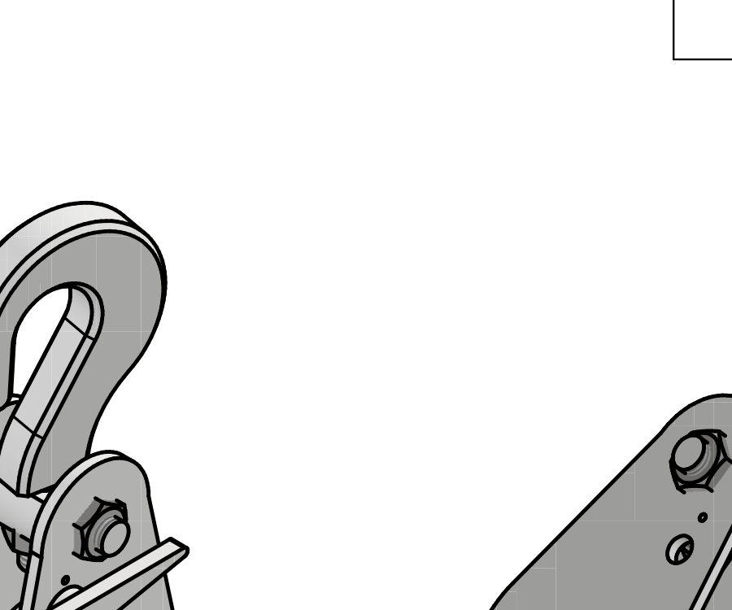

<h1 align="center">Hoist Pulley Block (Trócola) — Inventor CAD Model</h1>

  <b>Multi-body lifting mechanism with load hook, sheave, and ISO-standard fasteners</b>
   
  Built in Autodesk Inventor · Universidad Fidélitas · 2025

  
  
  
  
  

  
   
  <i>Assembled lifting pulley block (trócola): hook assembly (left) with sheave and side plate (right)</i>

---

## Overview

A fully modeled **multi-body mechanical assembly** of a hoist pulley block (snatch block / trócola in Costa Rican Spanish), designed in Autodesk Inventor. The design demonstrates:

- **Custom fabricated parts** (11 designed components): lifting hook with swiveling lug, grooved sheave, dual support side plates, coupling cover, and structural fastener bosses  
- **ISO standard fasteners**: M10 and M12 hex nuts (ISO 4032) for load-bearing assembly  
- **Complete assembly**: all parts constrained and positioned in `Ensamble.iam`  
- **Exploded presentation** (`Ensamble video.ipn`) showing component relationship and assembly sequence  
- **Animation** (`assembly-animation.wmv`) demonstrating the assembled mechanism  
- **Technical drawing** (`plano.dwg` + PDF) with parts list, dimensioning, and orthogonal views

### Mechanism at a glance

| Attribute | Details |
|---|---|
| **Type** | Snatch block / block-and-tackle lifting pulley |
| **Components** | 11 custom parts + 2× ISO 4032 M10 + 1× ISO 4032 M12 |
| **Assembly** | Load hook + fixed sheave + retaining plates + fasteners |
| **Key features** | Swiveling lifting hook, grooved pulley (sheave), twin side-plate support structure |
| **Scale** | Full-size mechanical drawing (dimensions per drawing) |

---

## Components

| Item # | Name | Part | Qty | Function |
|---|---|---|---|---|
| 1 | Placa de soporte | *Support plate* | 2 | Side structural frame |
| 2 | Cubierta de acoplamiento | *Coupling cover* | 1 | Sheave retention cap |
| 3–5, 7–11 | Piezas (custom) | *Standard parts* | 8 | Structural / load-bearing components |
| 6 | Gancho | *Lifting hook* | 1 | Load attachment point |
| 12 | ISO 4032 — M12 | *Hex nut (metric)* | 1 | Main fastener |
| 13 | ISO 4032 — M10 | *Hex nut (metric)* | 2 | Secondary fasteners |

---

## Engineering highlights

✓ **Multi-body assembly** — 11 custom parts constrained and positioned with full mate relationships  
✓ **Exploded presentation** — interactive exploded view showing assembly sequence and component arrangement  
✓ **Animation** — timeline-driven `assembly-animation.wmv` demonstrating the complete assembly  
✓ **ISO standard fasteners** — real metric hardware (M10, M12) from Inventor's standard library  
✓ **Functional geometry** — load-bearing hook, grooved sheave for rope/chain, load-bearing support plates  
✓ **Technical drawing set** — orthogonal views, parts list, dimensioning per engineering standards  

---

## Repository contents

| File / Folder | Description |
|---|---|
| [`cad/`](cad/) | Inventor source files (all `.ipt` parts, `.iam` assembly, `.ipn` exploded view, `.ipj` project, `.dwg` drawing) |
| [`cad/assembly-animation.wmv`](cad/assembly-animation.wmv) | Video animation of the assembled mechanism |
| [`01-assembly-drawings.pdf`](01-assembly-drawings.pdf) | Technical drawing: orthogonal views, parts list, dimensions |
| [`previews/`](previews/) | Rendered preview images |

**Viewing:** the PDF opens in any browser or PDF reader. The Inventor files (`.iam`, `.ipt`, `.ipn`, `.ipj`) require [Autodesk Inventor](https://www.autodesk.com/products/inventor) (free student license available).

---

## Tools & skills

`Autodesk Inventor` · `Mechanical design` · `3D modeling` · `Assembly design` · `CAD drafting` ·
`ISO fastener selection` · `Technical drawing` · `Exploded views` · `Animation`

---

## Context

Course project for **Diseño Asistido por Computador** (Computer-Aided Design),  
**B.Sc. Mechatronics Engineering**, Universidad Fidélitas — 2025.

**Daniel Meneses Wright**  
[LinkedIn](https://www.linkedin.com/in/daniel-meneseswright/) · danimenwri@gmail.com

---

🇪🇸 Versión en español

 

## Descripción

Ensamble **mecánico multi-cuerpo** completo de una trócola (polea de amarre / snatch block), diseñado en Autodesk Inventor. El proyecto demuestra:

- **Piezas personalizadas** (11 componentes diseñados): gancho de levantamiento con orejeta giratoria, polea ranurada, placas de soporte duales, cubierta de acoplamiento y refuerzos de anclaje  
- **Tornillería ISO estándar**: tuercas hexagonales M10 y M12 (ISO 4032) para ensamble resistente a cargas  
- **Ensamble completo**: todas las piezas limitadas y posicionadas en `Ensamble.iam`  
- **Presentación explosionada** (`Ensamble video.ipn`) mostrando relación de componentes y secuencia de montaje  
- **Animación** (`assembly-animation.wmv`) demostrando el mecanismo ensamblado  
- **Plano técnico** (`plano.dwg` + PDF) con lista de piezas, acotación y vistas ortogonales

### Mecanismo resumen

| Atributo | Detalles |
|---|---|
| **Tipo** | Polea de amarre / trócola de levantamiento |
| **Componentes** | 11 piezas personalizadas + 2× ISO 4032 M10 + 1× ISO 4032 M12 |
| **Ensamble** | Gancho de carga + polea fija + placas de retención + tornillería |
| **Características clave** | Gancho de levantamiento giratorio, polea ranurada, estructura dual de placas laterales |
| **Escala** | Plano técnico a tamaño completo (cotas según dibujo) |

---

## Componentes

| Ítem # | Nombre | Descripción | Cant. | Función |
|---|---|---|---|---|
| 1 | Placa de soporte | Marcos estructural lateral | 2 | Estructura de soporte lateral |
| 2 | Cubierta de acoplamiento | Tapa de retención de polea | 1 | Retención de polea |
| 3–5, 7–11 | Piezas (personalizadas) | Piezas estándar | 8 | Componentes estructurales / resistentes a carga |
| 6 | Gancho | Punto de anclaje de carga | 1 | Levantamiento de carga |
| 12 | ISO 4032 — M12 | Tuerca hexagonal (métrica) | 1 | Fastener principal |
| 13 | ISO 4032 — M10 | Tuerca hexagonal (métrica) | 2 | Fasteners secundarios |

---

## Aspectos de ingeniería

✓ **Ensamble multi-cuerpo** — 11 piezas personalizadas limitadas y posicionadas con relaciones de restricción completas  
✓ **Presentación explosionada** — vista explosionada interactiva mostrando secuencia de montaje y disposición de componentes  
✓ **Animación** — `assembly-animation.wmv` basado en línea de tiempo demostrando el ensamble completo  
✓ **Tornillería métrica ISO estándar** — hardware real métrico (M10, M12) de la librería estándar de Inventor  
✓ **Geometría funcional** — gancho resistente a carga, polea ranurada para cable/cadena, placas de soporte resistentes  
✓ **Juego de planos técnico** — vistas ortogonales, lista de materiales, acotación conforme a estándares de ingeniería  

---

## Contenido del repositorio

| Archivo / Carpeta | Descripción |
|---|---|
| [`cad/`](cad/) | Archivos fuente de Inventor (todas las piezas `.ipt`, ensamble `.iam`, vista explosionada `.ipn`, proyecto `.ipj`, plano `.dwg`) |
| [`cad/assembly-animation.wmv`](cad/assembly-animation.wmv) | Animación de video del mecanismo ensamblado |
| [`01-assembly-drawings.pdf`](01-assembly-drawings.pdf) | Plano técnico: vistas ortogonales, lista de piezas, cotas |
| [`previews/`](previews/) | Imágenes de vista previa renderizadas |

**Contexto:** proyecto del curso **Diseño Asistido por Computador**, B.Sc. Ingeniería Mecatrónica, Universidad Fidélitas — 2025.

